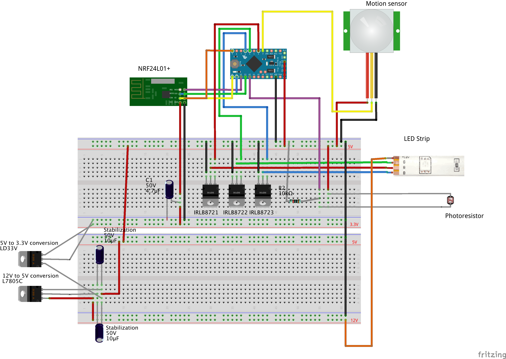
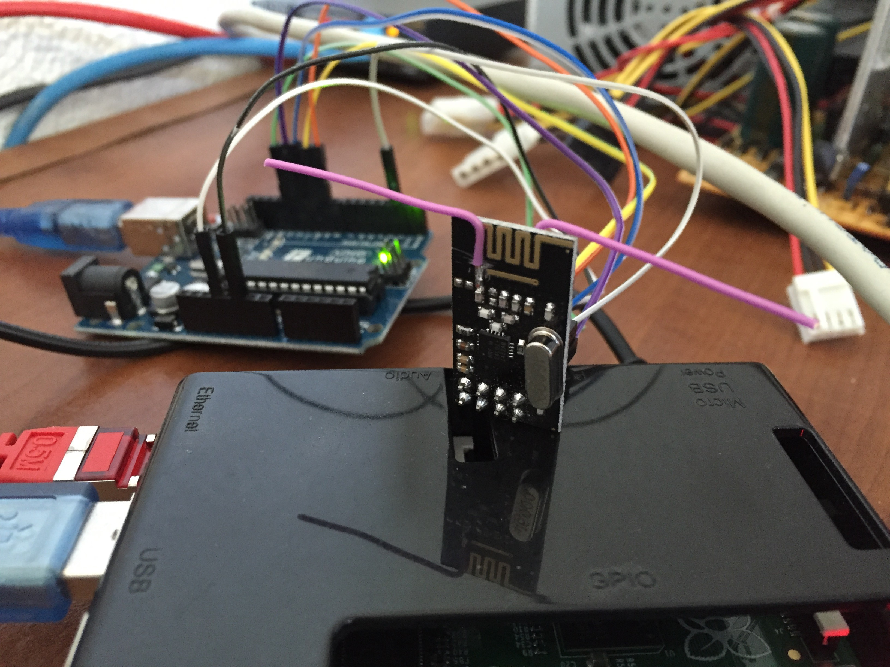

# homesensors

My Arduino project leveraging [MySensors](http://mysensors.org): a 3 colors dimmable LED with motion and photocell sensors. Colors are configurable remotely via a [MySensors](htt://mysensors.org) gateway (using [domoticz](domoticz.com)) for now.

Typical light with motion detection use case for outside.

Video of the result embedded into a rock gabion: 

Overall [fritzing](http://fritzing.org) diagram of the project:

Some resources I followed / inspired from for my project:

* Arduino and LED Strip [learn.adafruit.com/rgb-led-strips](https://learn.adafruit.com/rgb-led-strips) 
* Arduino and photoresistor [blog.udemy.com/arduino-ldr](https://blog.udemy.com/arduino-ldr/)
* Arduino and motion sensor [learn.adafruit.com/pir-passive-infrared-proximity-motion-sensor](https://learn.adafruit.com/pir-passive-infrared-proximity-motion-sensor/)
* [Enhanced-NRF24L01 instructable](http://www.instructables.com/id/Enhanced-NRF24L01/) in order to improve wireless transmissions. But will still need to buy a transmitter with Antenna to mount into waterproof box.  

